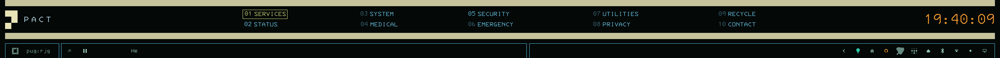
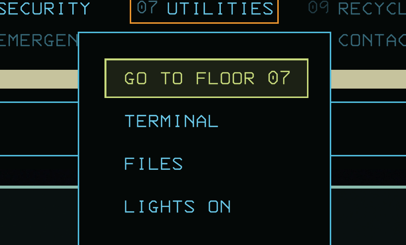
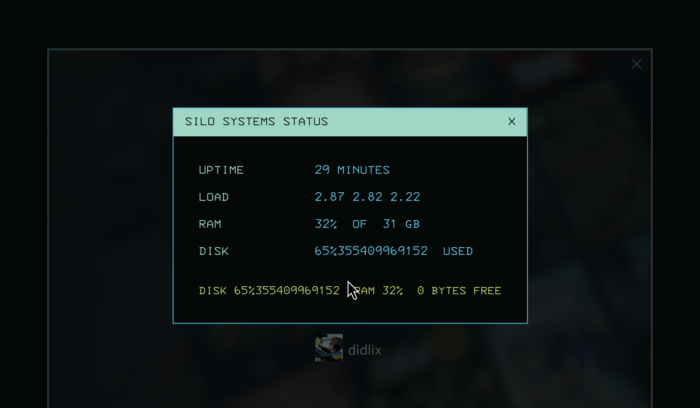

# pact.bar

A PACT terminal top bar for [Omarchy](https://omarchy.org) — a full
replacement for the stock bar, styled after the silo's CRT terminals.
Companion to the [The Pact theme](https://github.com/didlix/omarchy-thepact-theme),
but runs on any theme (colours fall back to built-in PACT defaults).



Two rows, like the show's header: the top row carries the block emblem,
wordmark, your ten workspaces as numbered floor sections, and a chonky
amber clock; the second row is the plugin dock — every stock bar widget
(menu, tray, audio, network, and any third-party widgets you run) in three
framed boxes mirroring the stock bar's left/centre/right regions.

## Sections are menus

Every floor section opens a submenu: jump to the workspace, run Omarchy
actions, launch apps, or open the built-in PACT windows (a live SILO
STATUS readout, the PACT COUNTER, an EMERGENCY broadcast). Entries with
live state — night light, stay-awake, do-not-disturb — probe the real
system state when the menu opens and show the inverse action while on.




## Install

```sh
git clone https://github.com/didlix/omarchy-plugin.pact-bar \
  ~/.config/omarchy/plugins/pact.bar
ln -s ~/.config/omarchy/plugins/pact.bar/bin/pactcli ~/.local/bin/pactcli
pactcli bar on
```

`pactcli bar on|off|toggle` swaps between this bar and the stock bar
(only one bar can occupy the shell's bar slot; whichever is active hosts
all the plugin widgets). To swap automatically with your theme, install
the hook:

```sh
omarchy hook install theme-set ~/.config/omarchy/plugins/pact.bar/bin/pact-theme-hook
```

Optional keybinding for keyboard control of the bar (arrows/hjkl navigate,
Enter opens menus, Esc backs out), in `~/.config/hypr/bindings.lua`:

```lua
o.bind("SUPER + SHIFT + T", "Focus PACT bar", "omarchy-shell pact.bar focus")
```

## Configure

User config lives at `~/.config/omarchy/pact/config.toml` (live-reloaded);
the file documents its own schema and every menu item is yours to change —
top level included. Rename sections, choose how many floors show
(`[bar] sections`), replace any section's submenu with your own entries,
define custom state probes from any command's exit status, pin the PACT
unit (emblem block = band thickness), cap the section spread width, and
set the counter's label and target date. The complete defaults are
reproduced as copy-paste config in
[docs/DEFAULT-MENUS.md](docs/DEFAULT-MENUS.md). `pactcli config get|set`
edits values from scripts.

Colours come from the active theme's `shell.toml` `[pact]` section (see
The Pact theme for the reference palette) with built-in fallbacks.

## CLI

```
pactcli bar on|off|toggle|status|apply
pactcli window status|counter|emergency|close
pactcli menu <1-10>
pactcli focus
pactcli config get|set <section.key> [value]
```

## Provenance

This bar is a fork of Omarchy's stock Quickshell bar (MIT) with the PACT
chrome, sections, menus, windows, and CLI layered on top — all the stock
widget hosting, popups, and tooltips are preserved. The upstream widget
catalogue is kept at [docs/UPSTREAM-BAR.md](docs/UPSTREAM-BAR.md). After
major Omarchy bar updates, re-basing the fork on a fresh clone is the
supported path.

A fan tribute to the terminals of *Silo* (Apple TV+). Not affiliated with,
or endorsed by, Apple or the show's producers.
